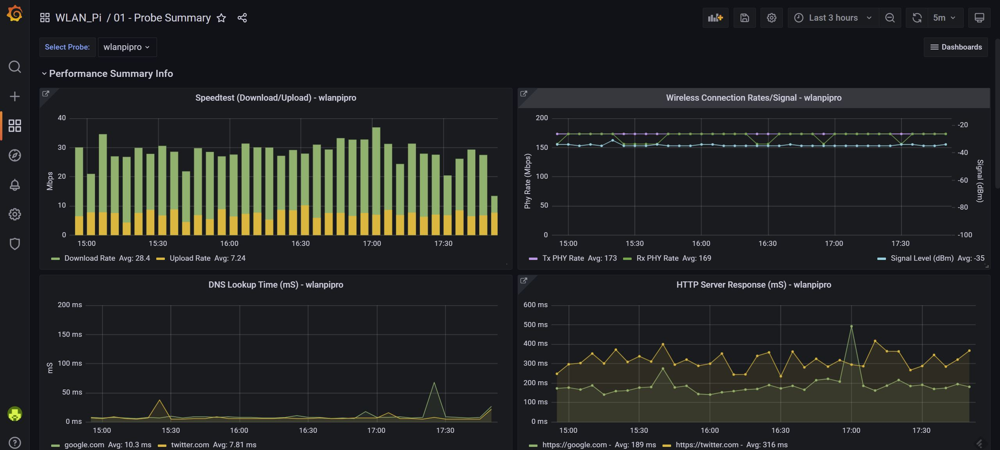
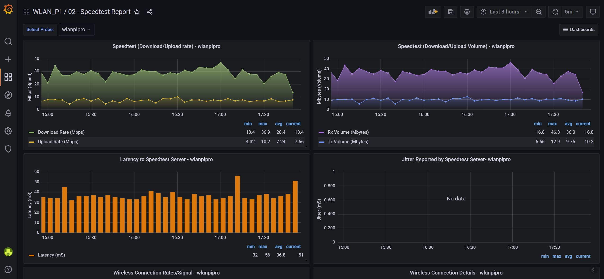

Title: Wiperf V2.5 Documentation
Authors: Nigel Bowden

# Wiperf V2.5: An Open Source UX Performance Probe
{ align=right }

Wiperf is a utility that is included in the [WLAN Pi](https://wlan-pi.github.io/wlanpi-documentation/) software distribution. It allows the WLAN Pi to act as a network probe that runs a series of  network performance tests. It is primarily intended to provide an indication of the end-user experience on a wireless-connected network, but may also be used as an ethernet-connected probe.

The probe can run the following tests to give an indication of the performance of the network environment into which it has been deployed:

- Wireless connection health check (if wireless connected)
- Speedtest (Ookla/Librespeed)
- iperf3 (TCP & UDP tests)
- ICMP ping
- HTTP
- DNS
- DHCP
- SMB

Tests may be performed over the wireless or ethernet interface of the probe unit. The results must then be sent back to a InfluxDB/Grafana "data collection server" to provide a reporting capabilities.

Wiperf has been primarily designed to be a tactical tool for engineers to deploy on to a wireless network where issues are being experienced and longer term monitoring may be required. It will likely not replace large-scale commercial offerings that provide wireless and end-user experience monitoring, though multiple probes may be deployed and report in to a centralized data collection server.

Tests are run sequentially on the Wiperf probe at a user-configured interval (usually 5 minutes). Collected performance data is sent back to a data collection server over a network connection between the probe and server. The data collection server requires two (free) software packages to collect and report on the data generated by Wiperf:

- InfluxDB: a time-series database
- Grafana: a reporting/visualization tool  

## Data Collection Server
The Wiperf software package included in the WLAN Pi distribution does not include the InfluxDB and Grafana packages. They are additional packages that must be downloaded from their respective websites and installed separately.

The data collection server is a critical component that allows collection and visualization of performance data.  High-level configuration details are provided within the Wiperf documentation set to "get you going" with both InfluxDB and Grafana. However, detailed information about the operation of these platforms is beyond the scope of this project. Please consult the InfluxDB and Grafana web sites for detailed configuration and troubleshooting information.

### InfluxDB
InfluxDB is a "NoSQL" database server, which means that no data structures need to be pre-defined in database tables. This means we can send network performance data to the server with very little set-up compared to a traditional, relational database server.

As long as we have a valid set  of credentials for the database server, we can send JSON-formatted data over HTTPS in any structure we choose. A database query language on the data server allows us to retrieve data collected by the Wiperf probe to feed in to a reporting tool (e.g. Grafana).

### Grafana
Grafana is a popular open-source data visualization tool. It is used to graph the performance data collected by Wiperf. However, Grafana needs a data source from which to pull the network performance data. To meet this requirement, the InfluxDB database server is used as a data source. Like Grafana, InfluxDB is also an open-source package.

- Grafana web site (v8.3): [https://grafana.com/](https://grafana.com/)
- Influx web site (v1.8): [https://www.influxdata.com](https://www.influxdata.com)

## Workflow to Setup Wiperf

The workflow to get Wiperf fully operational consists of a number of steps that break down in to two main areas:

- Probe setup (setup the WLAN Pi device itself)
- Data collection server setup (Influx/Grafana server)

The data server setup tends to be a task that needs completion only once (or at least very infrequently). 

Conversely, some or all of the probe setup will need to be completed each time a probe is deployed - this is mainly due to the fact that in each environment in which it is deployed, the connectivity for the probe will vary (e.g. different SSID, different network connection type etc.). 

Here is an overview of the workflow::

- Data collection server setup:
    - Prepare a server platform
    - Obtain the data collection server application software
    - Install the data collection server application(s)
    - Configure the data collection server application(s)
- Probe setup:
    - Obtain a probe device (WLAN Pi)
    - Install the Wiperf software (well, usually just update the software, if required)
    - Configure Wiperf
    - Deploy & test the Wiperf probe

__Workflow Links:__

- Start here for the data collection platform: [link](influx_platform.md)
- Start here for the probe: [link](probe_preparation.md)

In addition to the setup and deployment of the components, there may also be a requirement to troubleshoot the setup. The following pages provide useful support information:

- [Troubleshooting steps](troubleshooting.md)
- [Review known issues / FAQ](faq/md)]

## Further Documentation References

- [Configuration file parameters](config.ini.md)
- [Data points sent by the probe to the data collection server platform](data_points.md)

## Caveats
This free software is provided for you to use at your own risk. There are no guarantees around its operation, suitability or accuracy of the data that it provides. Please consult the [license file](https://github.com/wifinigel/Wiperf/blob/main/License.txt) shipped with this software.

