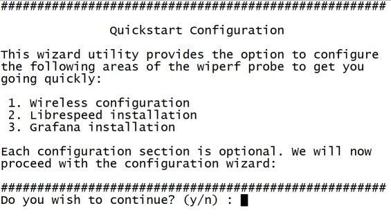

Title: Quickstart
Authors: Nigel Bowden

# Quickstart Guide
{ align=right }
Getting up and going with Wiperf can be quite tricky if you aren't familiar with Linux and setting up a separate server to act as a data collection server. Therefore, starting with v2.5, a quickstart script is provided that:

- Configures the wireless interface of the probe
- Applies a basic probe configuration to get you started with testing
- Installs InfluxDB and Grafana on to the WLAN Pi to provide an on-board reporting server
- Configures Grafana with a set of dashboard reports to start reporting on network health

The script takes less than 5 minutes to get a fully functioning Wiperf probe up and running.

## Running the Quickstart Script
To run the quickstart script, power up your WLAN Pi and ensure it is connected to the Internet. If you have a switch port with Internet access, simply cable it to the Ethernet port of the WLAN Pi - DHCP will take care of the rest.

Before running the quickstart script, ensure that the WLAN Pi is in "classic" mode.

Next, SSH to the WLAN Pi and run the following commands:

```
cd /opt/wlanpi-wiperf/extras
sudo ./quick_start.sh
```

A CLI wizard will now walk you through the steps to configure the WLAN Pi and installed the required reporting software:



The wizard will walk you through the following processes:

 - Configuration of the wireless network connection to test your wireless network (note the security methods supported are WPA2 PSK & PEAP)
 - Installation of the Librespeed speedtest utility if you would like to use it in addition to the Ookla speedtest utility supported out of the box 
 - Installation of the InfluxDB and Grafana plus reporting dashboards on to the WLAN Pi to provide local reporting.

The wizard also provides the option to switch the WLAN Pi in to Wiperf mode so that you can start testing and reporting on your wireless network straight away.

Instructions for accessing the Grafana web UI to view the reports are provide on-screen at the end of the Grafana installation process.

## Further Documentation
I have created a wide range of documentation to help you to get your wiperf probe going, together with the basics of setting up a suitable reporting platform. Please take time to read through this documentation before reaching out for support. 

I recommend that you start [here](operation.md) and work sequentially though the [documentation provided](operation.md).

